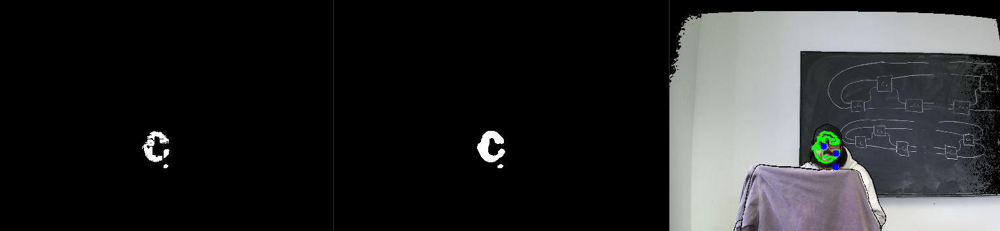

# PCD - Partially Covered Detection of Humans  
**Developer Team**: Tarnveer Takhtar, Matthew Bradbury, Harman Bassi, Kyen So  
**Project Start Date**: September 9th, 2024  
**Project End Date**: March 30th, 2025  

---

## 🎯 Project Overview  

PCD (Partially Covered Detection) is a real-time 3D perception system designed to enable safe human-robot interaction by detecting partially obscured humans in point cloud data. Unlike skeleton tracking solutions, PCD reconstructs full body volumes and location estimates even when people are blocked by objects or only partially visible to the sensor.  

Developed specifically for assistive robotics applications, this system uses deterministic geometric algorithms to reliably estimate the space occupied by people's heads, torsos and limbs as well as estimate the regions in which humans lie, critical for robots that need to navigate safely around humans in homes, hospitals, or industrial settings.   

Key capabilities:
- Works with both live Kinect sensor data and offline point cloud files.
- Handles challenging cases like multiple occluded people.
- Adapts to various body poses and orientations.
- Processes data in real-time for responsive robot control.
- No machine learning: no models or machine learning techniques were used to train the system.

## 🌟 Key Features  
### 1. **Plane Detection & Removal**  
- **Depth Gradient Analysis**: Identifies planar surfaces (walls/floors) using Sobel operators and normalized depth gradients.  
- **Surface Normal Consistency**: Filters regions with uniform normals to isolate flat surfaces.  
- **Morphological Refinement**: Closes gaps in detected planes using erosion/dilation.  

    

### 2. **Skin Region Detection**  
- **HSV Filtering**: Isolates skin tones using hue-saturation-value thresholds.  
- **Contour-Based Centroid Extraction**: Converts 2D skin regions to 3D seed points for clustering.

    

### 3. **Point Cloud Filtering**  
- **Voxel Downsampling**: Reduces data density for real-time processing.  
- **Statistical Outlier Removal**: Eliminates sensor noise using neighborhood analysis.  
- **RANSAC Plane Segmentation**: Further removes undetected planar regions. 

    

### 4. **Region Growing**  
- **Multi-Radius Seed Initialization**: Robustly starts clusters from skin points in noisy data.  
- **Normal-Guided Expansion**: Uses surface normals and Euclidean thresholds to grow human-shaped clusters.  
- **Directional Tracking**: Logs growth vectors for spatial reasoning to compute estimated regions. 

    

### 5. **Region Estimation**  
- **PCA-Based Direction Analysis**: Identifies limb/torso alignment from centroid trajectories.  
- **Offset Prediction**: Determines left/right placement using furthest seed-centroid pairs.  
- **Weighted Decision Matrix**: Combines directional metrics for robust human localization.

    

    

### 6. **Visualization**
- **3D Point Cloud Rendering**: Displays processed point clouds with color-coded regions.
- **Real-Time Feedback**: Provides immediate visual feedback on detected regions.
- **Live/Offline Mode**: Supports both live Kinect data and offline PCD files for testing.
- **Debugging Info**: Includes enabling/disabling of debug information via keypress ('d').
- **Save Point Cloud**: Allows saving of processed point clouds during live run for further analysis later via keypress ('s').

## 🛠️ Installation  
Build instructions and dependency setup are documented in [src/Setup.md](src/Setup.md). This includes:
- Visual Studio 2022 installation
- Microsoft Kinect SDK 2.0 installation
- Point Cloud Library (PCL) installation
- OpenCV installation

## 📦 Dependencies
- **PCL 1.14.1** (with VTK 9.3)
- **OpenCV 4.x** (with contrib modules)
- **Microsoft Kinect SDK 2.0**
- **CMake 3.5+**

This project includes a modified version of `kinect2_grabber.h` originally developed by [UnaNancyOwen](https://github.com/UnaNancyOwen/KinectGrabber) under the MIT license. The file was modified to support current versions of the PCL Library (1.14.x+) for Kinect v2 data acquisition.

## 📂 Project Structure
The folders and files for this project are as follows:

docs - Documentation for the project

refs - Reference material used for the project, including papers

src - Source code

test - Test files for offline processing

## 📜 License  
This project is licensed under the MIT License. See [LICENSE](docs/LICENSE.md).  
